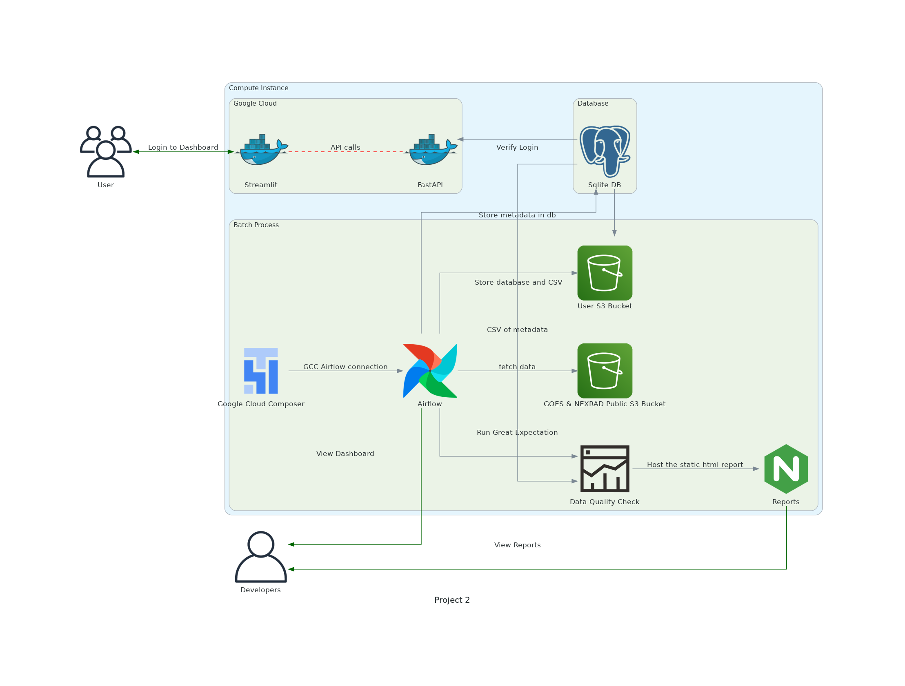

# Assignment_02

> [Application Link](http://34.73.178.159:8501/login) (**Login Credential** - Username: damg7245, Password: spring2023)  <br>
> [Codelabs Documentation](https://codelabs-preview.appspot.com/?file_id=1mYE7swaLKECj7j_yHg2l7awS30_TEiA891EELlxv6H8#0 )<br>
> [FastAPI Docs](http://34.73.178.159:8000/docs) <br>
> [Docker Images](https://hub.docker.com/r/shankardh/team7/tags) <br>

## Objective

The primary objective is to create a platform to provide data retrieval service for satellite images in NOAA’s GOES18 and Nexrad AWS S3 buckets. A user can either provide input for image-related attributes or directly provide a filename to generate a link to the file.

## Usecase

- A user can fetch the data either by providing date and station features or by providing a valid file name
- A downloadable link to the file is provided for both NOAA’s and Private buckets
- A plot for all NEXRAD stations across the US

**Note:** The data is scrapped from publicly accessible data in NOAA’s S3 buckets - [GOES18](https://noaa-goes18.s3.amazonaws.com/index.html#ABI-L1b-RadC/) & [NEXRAD](https://noaa-nexrad-level2.s3.amazonaws.com/index.html) which is refreshed daily with Airflow DAGs

## Tech Components

- Backend 
  - FastAPI - RestAPI endpoints 
  - Airflow, GCC (GCP) - Automated data retrieval (daily refresh) 
  - AWS Cloudwatch - Cloud logging of application run
- Frontend UI - Streamlit 
- Deployment 
  - Docker - Individual containerization for backend and frontend, connected through Docker Compose 
  - GCP - Google Cloud platform for Docker containers deployment
- Data Quality Check - Great Expectations

#### Architecture Diagram


## Backend - FastAPI, Airflow, AWS Cloudwatch

The backend is designed in a way that it facilitates API calls for communication between Frontend and the Backend. The RestAPIs developed with FASTAPI are restricted with JWTAuthentication through which a token is generated with an expiry of 30mins for every new user. The major operations are - 
- Single User retrieval
- JWTToken authentication
- Query data from the database as demanded
- File source URL generation AND, 
- Copying to personal AWS bucket

## Frontend - Streamlit

The UI was developed with the help of the python library of Streamlit framework. The application follows the following flow - 

- User Logins with given credentials
- Once logged in there are five modules that the user can access - 
  - Goes - Feature-based file extraction for Goes18 
  - Goes file link - File name based url generation for Goes18
  - Nexrad - Feature-based file extraction for Nexrad
  - Nexrad file link - File name based url generation for Nexrad
  - Nexrad plot - Plot of all Nexrad stations in the United States
- Logout - To exit the app

## Deployment - Docker + GCP

- Both the backend and frontend are individually containerized using docker. Then docker-compose is used to bind the two containers and are deployed on the GCP instance
- The usage activity is logged in AWS Cloudwatch and we have created a module for unit testing using the python library ‘Pytest’. 

## Steps to run the application locally - 

- Clone repository 
- Create .env file with AWS Bucket and Logging credentials. Format to follow (access token automatically generates with login, but variable should be there) -
```
AWS_LOG_ACCESS_KEY= <enter your Log access Key>
AWS_LOG_SECRET_KEY= <enter your Log secret Key>
AWS_ACCESS_KEY1 = <enter your AWS access Key>
AWS_SECRET_KEY1 = <enter your AWS secret Key>
access_token=
 ```
- Pull docker files through dockerhub using following commands - 
```
docker pull shankardh/team7:Dockerfile_streamlit
docker pull shankardh/team7:Dockerfile_fastapi
```
- Create a new docker-compose.yml file with the follwoing code 

```
version: '3'

services:
  fastapi:
    container_name: fastapi
    restart: always
    build:
      context: .
      dockerfile: Dockerfile_fastapi
    ports:
    - "8000:8000"
    networks:
      mynetwork:
        aliases:
        - fastapi

  streamlit:
    container_name: streamlit
    restart: always
    build: 
      context: .
      dockerfile: Dockerfile_streamlit
    ports:
      - "8501:8501"
    networks:
      mynetwork:
        aliases:
        - streamlit
    environment:
      - FASTAPI_URL=http://fastapi:8000
    depends_on:
      - fastapi

networks:
  mynetwork:

```
- Execute the above docker compose file (docker-compose.yml) with the command ‘docker compose up’

## File Structure - 

Please note currently, FASTAPI endpoints for multiple modules are not routed through individual modules instead are clubbed in main.py


#### Attestation
WE ATTEST THAT WE HAVEN’T USED ANY OTHER STUDENTS WORK IN OUR ASSIGNMENT AND ABIDE BY THE POLICIES LISTED IN THE STUDENT HANDBOOK


Contribution:
- Dhanush Kumar Shankar: 25%
- Nishanth Prasath: 25%
- Shubham Goyal: 25%
- Subhash Chandran Shankarakumar: 25%
